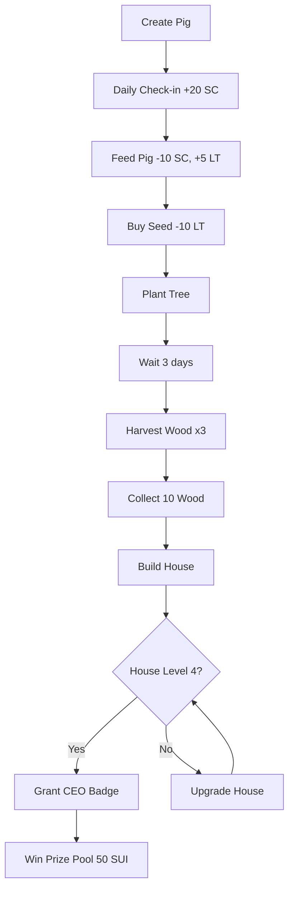

# 🐷 Hướng Dẫn Deploy PigLife Smart Contract

## 📋 **Tính năng mới trong contract:**

### ✅ **NFT System**
- **Pig NFT** - Main character với leveling
- **Wood NFT** - Building material với quality & origin tracking
- **Tree NFT** - Growing assets với growth stages
- **Seed NFT** - Planting items
- **House NFT** - Evolving buildings
- **CEO Badge** - Soulbound achievement NFT

### ✅ **Economic System**
- **Social Capital (SC)** - Earned through social actions
- **Life Token (LT)** - Used to buy seeds
- **Treasury** - Collects donations
- **Prize Pool** - Season rewards

### ✅ **Gameplay Features**
- **Feed Pig** - Level up system
- **Daily Check-in** - Streak rewards
- **Social Posts** - Create, like, share
- **Farming** - Plant trees, harvest wood
- **Building** - Burn wood to build houses
- **CEO Race** - Seasonal competition

---

## 🚀 **Bước 1: Build Contract**

```bash
cd Crowdfund-Web3-main
sui move build
```

**Expected output:**
```
BUILDING crowdfund
Successfully verified dependencies on-chain against source.
```

---

## 🚀 **Bước 2: Deploy to Testnet**

```bash
sui client publish --gas-budget 500000000
```

**⚠️ Lưu ý:** Deploy cần **~0.5 SUI** cho gas fee

---

## 📝 **Bước 3: Lưu Package ID**

Sau khi deploy thành công, copy **Package ID** từ output:

```
Created Objects:
│  ┌──
│  │ PackageID: 0xABCDEF123456... ← Copy cái này
│  │ Version: 1
│  └──
```

---

## 🔧 **Bước 4: Cập nhật Frontend**

Mở file `src/constants/index.ts` và cập nhật:

```typescript
// Update GAME_PACKAGE_ID
export const GAME_PACKAGE_ID = "0xABCDEF123456..."; // Paste Package ID từ bước 3
```

---

## 🎮 **Bước 5: Test Game**

### **1. Connect Wallet**
- Truy cập `http://localhost:5175/game`
- Click "Connect Wallet"
- Chọn Sui Wallet

### **2. Create Pig NFT**
- Click "Start Playing"
- Transaction sẽ tạo Pig NFT của bạn

### **3. Test các chức năng:**

#### 🐷 **Feed Pig**
```bash
# Frontend sẽ call:
feed_pig(pig: &mut Pig, clock: &Clock)
```
- Cost: 10 SC
- Reward: +5 LT, +20 EXP
- Cooldown: 4 hours

#### 📅 **Daily Check-in**
```bash
daily_checkin(pig: &mut Pig, clock: &Clock)
```
- Reward: +20 SC
- Streak counter increments

#### ✍️ **Create Post**
```bash
create_post(pig: &mut Pig, title: vector<u8>, content: vector<u8>)
```
- Reward: +50 SC
- Post becomes shared object

#### 🌱 **Buy Seed**
```bash
buy_seed(pig: &mut Pig, seed_type: vector<u8>, cost: 10)
```
- Cost: 10 LT
- Creates Seed NFT

#### 🪴 **Plant Tree**
```bash
plant_tree(pig: &mut Pig, seed: Seed, clock: &Clock)
```
- Burns seed
- Creates Tree NFT
- Growth stages: 0→1→2→3 (over 3 days)

#### 🪵 **Donate for Wood**
```bash
donate_for_wood(payment: Coin<SUI>, treasury: &mut GameTreasury)
```
- Cost: 1 SUI
- Reward: 1 Wood NFT (★★★★★ quality)
- Origin: "Community Donation"

#### 🏠 **Build House**
```bash
build_house(pig: &mut Pig, wood_nfts: vector<Wood>)
```
- Cost: 10 Wood NFTs
- Creates House NFT
- Level 4 House = CEO status

#### 🎖️ **Grant CEO Badge**
```bash
grant_ceo_badge(pig: &mut Pig, season: &mut Season)
```
- Requires House Level 4
- First CEO gets prize pool
- Soulbound NFT

---

## 🔍 **Kiểm tra trên Explorer**

### **1. View Contract**
```
https://suiexplorer.com/object/{PACKAGE_ID}?network=testnet
```

### **2. View Your Objects**
```
https://suiexplorer.com/address/{YOUR_ADDRESS}?network=testnet
```

Bạn sẽ thấy:
- **Pig NFT** - Main character
- **Wood NFTs** - Building materials
- **Tree NFTs** - Growing assets
- **House NFT** - Your building
- **CEO Badge** - If you achieved CEO

---

## 🎯 **Game Flow Example**



---

## 📊 **Contract Objects**

### **Owned Objects** (Transfer to player)
- `Pig` - Main game character
- `Wood` - Building material NFT
- `Tree` - Growing asset NFT
- `Seed` - Planting item
- `House` - Building NFT
- `CEOBadge` - Achievement NFT

### **Shared Objects** (Accessible by all)
- `GameTreasury` - Collects donations
- `Season` - Seasonal competition data
- `Post` - Social content

---

## 🛠️ **Troubleshooting**

### **❌ Error: "Module not found"**
```bash
# Solution: Build lại
sui move build
```

### **❌ Error: "Insufficient gas"**
```bash
# Solution: Request testnet SUI
https://discord.com/channels/916379725201563759/971488439931392130
```

### **❌ Error: "Object not found"**
```bash
# Solution: Kiểm tra Package ID trong constants/index.ts
```

### **❌ Error: "Not enough SC/LT"**
```bash
# Solution: 
# - Check-in daily để kiếm SC
# - Feed pig để kiếm LT
```

---

## 🎉 **Xong rồi!**

Contract đã sẵn sàng! Bây giờ bạn có thể:

1. ✅ **Test game** trên localhost:5175/game
2. ✅ **Create Pig NFT** và bắt đầu chơi
3. ✅ **Farm trees** và harvest wood
4. ✅ **Build houses** và compete for CEO
5. ✅ **Win prizes** in seasonal competitions

---

## 📚 **Tài liệu tham khảo**

- **Sui Move Docs:** https://docs.sui.io/build/move
- **Sui Explorer:** https://suiexplorer.com
- **Discord Support:** https://discord.gg/sui

---

## 🐛 **Report Issues**

Nếu gặp lỗi, hãy:
1. Check console log
2. Verify Package ID
3. Check wallet connection
4. Ask in Discord

Good luck farming! 🐷🌾🏠

