# 🎉 PigLife Game - Deployment Successful!

## ✅ **Deployment Summary**

**Date:** December 20, 2024  
**Network:** Sui Testnet  
**Status:** ✅ Successfully Deployed

---

## 📦 **Contract Information**

```
Package ID: 0x0db9ff1f0b8c5248cb919f8bd8a8c3f3d60580c932d428ba8a1732a06d24e4b5
Transaction: C65oK1aFM1TLBEjhryawPLbjbX5rxiaB2RTmSBPQdwer
Modules: pig_farming, pig_life, share
```

### **🔗 Explorer Links:**

**Package:**
```
https://suiexplorer.com/object/0x0db9ff1f0b8c5248cb919f8bd8a8c3f3d60580c932d428ba8a1732a06d24e4b5?network=testnet
```

**Transaction:**
```
https://suiexplorer.com/txblock/C65oK1aFM1TLBEjhryawPLbjbX5rxiaB2RTmSBPQdwer?network=testnet
```

---

## 🎮 **Enhanced Features**

### ✨ **New NFT System**
- 🐷 **Pig NFT** - Main character with leveling
- 🪵 **Wood NFT** - Building material with quality & origin tracking
- 🌳 **Tree NFT** - Growing assets (4 growth stages: seed→sprout→young→mature)
- 🌱 **Seed NFT** - Planting items
- 🏠 **House NFT** - Evolving buildings (4 levels)
- 🎖️ **CEO Badge** - Soulbound achievement NFT

### 💰 **Economic System**
- **Social Capital (SC)** - Earned through social actions
- **Life Token (LT)** - Used to buy seeds
- **Treasury** - Collects donations from players
- **Prize Pool** - Season rewards (50 SUI for first CEO)

### 🏆 **Season & CEO Race**
- **Duration:** 12 hours per season
- **Goal:** First player to reach House Level 4 becomes CEO
- **Prize:** 50 SUI for first CEO each season
- **Reset:** Progress resets after season (except SUI balance)

---

## 📊 **Scoring System**

```javascript
Score = 
  Pig Level × 100
+ Social Capital × 2
+ Life Token × 5
+ Wood NFTs × 50
+ House Level × 500
+ Streak Days × 50
+ Posts × 100
+ CEO Status × 5000
```

---

## 🎯 **Game Flow**

```mermaid
graph TD
    A[Create Pig NFT] --> B[Daily Check-in +20 SC]
    B --> C[Feed Pig -10 SC +5 LT]
    C --> D[Buy Seed -10 LT]
    D --> E[Plant Tree]
    E --> F[Wait for growth]
    F --> G[Harvest Wood NFTs]
    G --> H[Collect 10 Wood]
    H --> I[Build House]
    I --> J{House Level 4?}
    J -->|Yes| K[🎖️ Become CEO]
    J -->|No| L[Upgrade House]
    L --> J
    K --> M[💰 Win 50 SUI]
    M --> N[Season Resets]
    N --> A
```



---

## 🚀 **How to Play**

### **1. Access Game**
```
http://localhost:5175/game
```
or
```
http://localhost:5175/piglife
```

### **2. Connect Wallet**
- Click "Connect Wallet"
- Select Sui Wallet
- Make sure you're on **Testnet**

### **3. Create Your Pig**
- Click "Start Playing"
- Transaction will create your Pig NFT
- Cost: ~0.001 SUI (gas fee)

### **4. Play & Earn**

#### 📅 **Daily Check-in**
- Reward: +20 SC
- Streak bonus increases rewards
- Once per day

#### 🐷 **Feed Pig**
- Cost: 10 SC
- Reward: +5 LT, +20 EXP
- Cooldown: 4 hours
- Levels up your pig

#### ✍️ **Create Post**
- Reward: +50 SC
- Share your journey
- Build community

#### 🌱 **Farm & Build**
1. Buy Seed (10 LT)
2. Plant Tree
3. Wait 3 days for growth
4. Harvest Wood NFTs (1-3 depending on stage)
5. Collect 10 Wood
6. Build House

#### 🎖️ **Become CEO**
1. Build House Level 4
2. Call `grant_ceo_badge()`
3. If you're first this season → Win 50 SUI!
4. Get soulbound CEO Badge

---

## 🔄 **Season Mechanics**

### **Season Timer**
- Duration: 12 hours (43200000 ms)
- Auto-starts when first player joins
- Countdown visible on UI

### **Competition**
- All players compete to become first CEO
- Score tracked on leaderboard
- First to House Level 4 wins

### **Season End**
- Triggered automatically after 12 hours
- First CEO receives 50 SUI from prize pool
- All progress resets (pigs, houses, resources)
- **SUI balance is kept** (your earnings)
- New season starts immediately

### **Reset Items**
- ❌ Pig Level → 1
- ❌ House Level → 0
- ❌ Social Capital → 0
- ❌ Life Token → 0
- ❌ Wood NFTs → Burned
- ❌ Tree NFTs → Removed
- ❌ CEO Status → Reset
- ✅ SUI Balance → **Kept**
- ✅ CEO Badge → **Kept** (as achievement)

---

## 📚 **Smart Contract Functions**

### **Core Gameplay**
```move
create_pig()                  // Create Pig NFT
feed_pig(pig, clock)          // Feed pig (4h cooldown)
daily_checkin(pig, clock)     // Daily check-in
```

### **Social System**
```move
create_post(pig, title, content, clock)  // Create post (+50 SC)
like_post(pig, post)                     // Like post (+5 SC)
share_post(pig, post)                    // Share post (+30 SC)
support_post(pig, post, amount)          // Support with LT
```

### **Farming System**
```move
buy_seed(pig, seed_type, cost)           // Buy seed with LT
plant_tree(pig, seed, clock)             // Plant tree from seed
update_tree_growth(tree, clock)          // Update growth stage
harvest_tree(pig, tree)                  // Harvest wood NFTs
```

### **Building System**
```move
donate_for_wood(payment, treasury, origin)  // Donate 1 SUI → Get Wood NFT
build_house(pig, wood_nfts[], clock)        // Build house (10 wood)
sell_wood(pig, wood, treasury)              // Sell wood for SUI
```

### **Season & CEO**
```move
grant_ceo_badge(pig, season, clock)         // Grant CEO badge
check_and_end_season(season, clock)         // Check & end season
add_to_prize_pool(payment, season)          // Add to prize pool
calculate_score(pig) -> u64                 // Calculate score
```

---

## 🎨 **UI Features Updated**

### ✅ **Leaderboard Section**
- Top 10 Players display
- Real-time score updates
- CEO badge indicators
- Season timer countdown
- Your rank & score

### ✅ **Enhanced Game Cards**
- Fixed text colors (dark text on white cards)
- Better contrast and readability
- Hover effects
- Progress bars
- Status indicators

### ✅ **Game Guide**
- 6-step Vietnamese guide
- Visual flow diagram
- Clear instructions
- Progress roadmap

---

## 🛠️ **Technical Details**

### **Shared Objects**
```move
GameTreasury  // Collects donations
Season        // Season management
Post          // Social content
```

### **Owned Objects (NFTs)**
```move
Pig           // Main character
Wood          // Building material
Tree          // Growing asset
Seed          // Planting item
House         // Building
CEOBadge      // Achievement (soulbound)
```

### **Events Emitted**
```move
PigCreated, PigFed
PostCreated, PostLiked
TreePlanted, TreeHarvested
WoodPurchased, WoodSold
HouseBuilt
CEOAchieved
SeasonStarted, SeasonEnded
DailyCheckin
```

---

## 🔍 **Verification**

### **Check Contract on Explorer**
1. Open: https://suiexplorer.com
2. Switch to **Testnet**
3. Search: `0x0db9ff1f0b8c5248cb919f8bd8a8c3f3d60580c932d428ba8a1732a06d24e4b5`
4. View modules: `pig_life`, `pig_farming`, `share`

### **Check Your Objects**
After playing, check your wallet for:
- Pig NFT
- Wood NFTs
- Tree NFTs  
- House NFT
- CEO Badge (if achieved)

---

## 💡 **Tips & Tricks**

### **🎯 Strategy to Win**
1. **Check-in daily** for steady SC income (+20 SC/day)
2. **Feed pig regularly** every 4 hours for LT
3. **Create posts** for quick SC boost (+50 SC each)
4. **Donate 1 SUI** for instant Wood NFT (★★★★★ quality)
5. **Plant trees early** as they take time to grow
6. **Build house fast** to compete for CEO

### **⚡ Fast Track to CEO**
```
Day 1: Check-in + Feed + Create Post = 60 SC
       → Buy 6 seeds (60 LT needed)
Day 1: Plant 6 trees
Day 4: Harvest 18 Wood NFTs (3 per tree)
Day 4: Build House (use 10 wood)
Day 4: Build more houses to reach Level 4
Day 4: Call grant_ceo_badge() → WIN!
```

### **💰 Alternative: Buy Wood**
- Donate 1 SUI → Get 1 Wood NFT (★★★★★)
- Need 10 wood → Donate 10 SUI
- Instant house building!
- No waiting for tree growth

---

## 🐛 **Troubleshooting**

### **"Contract not deployed"**
✅ **Fixed!** Package ID updated in `src/constants/index.ts`

### **"No game found"**
- Click "Start Playing" to create Pig NFT
- Wait for transaction confirmation
- Refresh page (F5)

### **"Not enough SC/LT"**
- Check-in daily for SC
- Feed pig for LT
- Create posts for quick SC

### **"Cooldown not ready"**
- Wait 4 hours between pig feeds
- Timer shown in UI

### **"Not enough Wood"**
- Need 10 Wood NFTs to build house
- Either harvest trees OR donate SUI

---

## 📈 **Next Steps**

### **For Players:**
1. ✅ Connect wallet
2. ✅ Create Pig NFT
3. ✅ Start earning SC & LT
4. ✅ Plant trees & harvest wood
5. ✅ Build houses
6. ✅ Compete for CEO!

### **For Developers:**
1. ✅ Contract deployed & verified
2. ✅ Frontend connected
3. ⏳ Test all game functions
4. ⏳ Monitor season resets
5. ⏳ Add prize pool donations
6. ⏳ Deploy to mainnet (when ready)

---

## 🎉 **Success!**

🎮 **Game is LIVE:** http://localhost:5175/game  
📦 **Contract:** `0x0db9ff1f0b8c5248cb919f8bd8a8c3f3d60580c932d428ba8a1732a06d24e4b5`  
🏆 **Prize Pool:** 50 SUI per season  
🌐 **Network:** Sui Testnet

**Happy Farming! 🐷🌾🏠**

---

## 📞 **Support**

- **Discord:** https://discord.gg/sui
- **Docs:** https://docs.sui.io
- **Explorer:** https://suiexplorer.com
- **GitHub:** [Your repo]

---

*Deployed on: December 20, 2024*  
*Package Version: 1.0.0*  
*Contract: pig_life.move (Enhanced Edition)*

