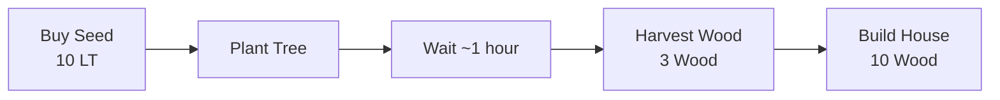

# 🐷 PigLife - Web3 Social Farming Game

<div align="center">


**Raise pigs, plant trees, build houses, and become CEO!**

[](https://sui.io/)
[](https://walrus.site/)
[](https://react.dev/)
[](https://www.typescriptlang.org/)

</div>

---

## 🎮 Giới Thiệu

**PigLife** là một game Web3 Social Farming được xây dựng hoàn toàn on-chain trên Sui blockchain, tích hợp Walrus để lưu trữ phi tập trung.

### ✨ Tính Năng Chính

- 🐷 **Pig Farming System** - Nuôi heo, feed để kiếm Life Token và level up
- 🌱 **Advanced Farming** - Trồng cây, thu hoạch gỗ với hệ thống growth time
- 🏠 **Building Progression** - Xây nhà từ thô sơ đến hiện đại
- 👥 **Social Actions** - Kiếm Social Capital qua post, check-in, share, invite
- 🏆 **CEO Race** - Đua tranh trở thành CEO đầu tiên, nhận 50 SUI!
- 💾 **Walrus Backup** - Backup game state lên decentralized storage
- 📊 **Leaderboard** - Bảng xếp hạng real-time cho tất cả người chơi
- ⏱️ **Season System** - Reset game mỗi 1 giờ, bắt đầu race mới

---

## 🚀 Quick Start

### Prerequisites

- Node.js 18+
- Sui CLI 1.40+
- Sui Wallet (Browser Extension)
- Git

### Installation

```bash
# Clone repository
cd Crowdfund-Web3-main

# Install dependencies
npm install

# Install Walrus SDK
npm install @mysten/walrus

# Setup environment
cp .env.example .env
# Edit .env and add your SUI_PRIVATE_KEY
```

### Deploy Smart Contract

```bash
# Build
sui move build

# Deploy
sui client publish --gas-budget 500000000

# Copy Package ID from output and update src/constants/index.ts
```

### Run Development Server

```bash
npm run dev
# Open http://localhost:5173/piglife
```

---

## 📂 Cấu Trúc Project

```
Crowdfund-Web3-main/
├── sources/
│   ├── pig_life.move          # Smart contract chính
│   ├── pig_farming.move        # Contract cũ (legacy)
│   └── share.move
├── src/
│   ├── components/
│   │   └── piglife/
│   │       ├── PigLifeGame.tsx # Main game component
│   │       └── index.ts
│   ├── hooks/
│   │   ├── usePigLifeGame.ts   # Game hooks
│   │   └── index.ts
│   ├── utils/
│   │   └── walrus.ts           # Walrus integration
│   ├── constants/
│   │   └── index.ts            # Config & constants
│   └── App.tsx
├── PIGLIFE_DEPLOY.md          # Hướng dẫn deploy chi tiết
├── WALRUS_SETUP.md            # Hướng dẫn Walrus
└── package.json
```

---

## 🎯 Gameplay

### 1️⃣ Pig Farming

Feed heo để kiếm Life Token và EXP:

```
Cost: 10 Social Capital
Reward: 5 Life Token + 20 EXP
Cooldown: 4 hours
Level Up: Every 100 EXP
```

### 2️⃣ Social Actions

Kiếm Social Capital:

| Action | Reward | Frequency |
|--------|--------|-----------|
| 📅 Daily Check-in | +20 SC | 1/day |
| ✍️ Create Post | +50 SC | Unlimited |
| 🔄 Share Content | +30 SC | Unlimited |
| 👥 Invite Friend | +100 SC | Unlimited |

### 3️⃣ Farming & Harvesting



### 4️⃣ Building & CEO

- Build house: **10 Wood** → +1 House Level
- Reach **Level 4** → Become **CEO** 🎖️
- **First CEO** wins → **50 SUI** 💰

### 5️⃣ Season System

- Duration: **1 hour**
- Winner: First player to reach CEO
- After season: Game resets, keep SUI balance
- New season starts automatically

---

## 💻 Development

### Smart Contract Development

```bash
# Build contract
sui move build

# Test contract
sui move test

# Deploy to testnet
sui client publish --gas-budget 500000000

# Call functions
sui client call \
  --package <PACKAGE_ID> \
  --module pig_life \
  --function create_game \
  --args <CLOCK_ID> \
  --gas-budget 10000000
```

### Frontend Development

```bash
# Start dev server
npm run dev

# Build for production
npm run build

# Preview production build
npm run preview

# Lint code
npm run lint
```

### Testing

```bash
# Run all tests
npm test

# Run specific test
npm test -- walrus

# Coverage
npm run test:coverage
```

---

## 🔗 Smart Contract API

### Main Functions

#### `create_game(clock: &Clock)`
Tạo game mới cho người chơi.

**Returns**: `PigLifeGame` object

#### `feed_pig(game: &mut PigLifeGame, clock: &Clock)`
Feed heo, kiếm Life Token và EXP.

**Requirements**:
- Social Capital ≥ 10
- Cooldown ready (4 hours)

**Effects**:
- -10 Social Capital
- +5 Life Token
- +20 EXP
- Level up nếu đủ EXP

#### `buy_seed(game: &mut PigLifeGame, clock: &Clock)`
Mua hạt giống.

**Cost**: 10 Life Token  
**Reward**: 1 Seed

#### `plant_tree(game: &mut PigLifeGame, clock: &Clock)`
Trồng cây.

**Requirements**: Seeds ≥ 1  
**Effects**: -1 Seed, +1 Tree

#### `harvest_wood(game: &mut PigLifeGame, clock: &Clock)`
Thu hoạch gỗ.

**Requirements**: Trees ≥ 1  
**Reward**: 3 Wood per tree

#### `build_house(game: &mut PigLifeGame, leaderboard: &mut Leaderboard, clock: &Clock)`
Xây nhà.

**Cost**: 10 Wood  
**Effects**:
- +1 House Level
- Become CEO at Level 4
- Win 50 SUI if first CEO

### View Functions

#### `get_game_data(game: &PigLifeGame)`
Lấy toàn bộ game state.

**Returns**: Tuple với tất cả stats

#### `calculate_score(game: &PigLifeGame)`
Tính điểm tổng.

**Formula**:
```
score = (pig_level × 100) 
      + (social_capital × 2)
      + (life_token × 5)
      + (wood_count × 50)
      + (house_level × 500)
      + (streak_days × 50)
      + (total_posts × 100)
      + (is_ceo ? 5000 : 0)
```

---

## 💾 Walrus Integration

### Save Game State

```typescript
import { saveGameStateToWalrus } from "./utils/walrus";

const blobId = await saveGameStateToWalrus(gameState, signer);
console.log("Backed up:", blobId);
```

### Load Game State

```typescript
import { loadGameStateFromWalrus } from "./utils/walrus";

const gameState = await loadGameStateFromWalrus(blobId);
console.log("Restored:", gameState);
```

### Auto Backup

```typescript
import { autoBackup } from "./utils/walrus";

// Auto backup every hour
setInterval(async () => {
  const blobId = await autoBackup(gameState, signer);
  if (blobId) console.log("Auto-backed up:", blobId);
}, 60 * 60 * 1000);
```

Xem chi tiết: [WALRUS_SETUP.md](./WALRUS_SETUP.md)

---

## 🎨 UI Components

### Main Components

- **PigLifeGame**: Main game component
- **StatCard**: Display individual stats
- **GameCard**: Section wrapper với styling
- **SocialButton**: Social action buttons
- **GameStep**: Tutorial step display

### Styling

Sử dụng:
- TailwindCSS cho utility classes
- Custom CSS animations
- Gradient backgrounds
- Backdrop blur effects

---

## 🔧 Configuration

### Environment Variables

```env
# Required
SUI_PRIVATE_KEY=suiprivkey1q...

# Optional
WALRUS_STORAGE_NODE=https://storage.walrus-testnet.walrus.space
```

### Constants

Edit `src/constants/index.ts`:

```typescript
export const GAME_PACKAGE_ID = "0x..."; // Your deployed package ID
export const CLOCK_ID = "0x6";           // Sui Clock object
```

### Game Balance

Edit `sources/pig_life.move`:

```rust
const FEED_COST_SC: u64 = 10;              // Feed cost
const FEED_REWARD_LT: u64 = 5;             // Feed reward
const CEO_REWARD: u64 = 50_000_000_000;    // 50 SUI
const SEASON_DURATION: u64 = 3600000;      // 1 hour
```

---

## 🚢 Deployment

### Frontend (Vercel)

```bash
# Install Vercel CLI
npm i -g vercel

# Deploy
vercel --prod
```

### Frontend (Netlify)

```bash
# Build
npm run build

# Deploy dist/ folder
```

### Smart Contract

```bash
# Mainnet deployment
sui client switch --env mainnet
sui client publish --gas-budget 500000000

# Update GAME_PACKAGE_ID
```

---

## 📊 Monitoring

### View Transactions

```bash
# Get transaction digest from game events
sui client transaction <TX_DIGEST>
```

### Check Game State

```bash
# View game object
sui client object <GAME_ID>
```

### Sui Explorer

- Testnet: https://suiscan.xyz/testnet
- Mainnet: https://suiscan.xyz/mainnet

---

## 🐛 Troubleshooting

### Issue: Contract not deployed

**Solution**: 
1. Deploy contract: `sui client publish --gas-budget 500000000`
2. Update `GAME_PACKAGE_ID` in `src/constants/index.ts`

### Issue: Network mismatch

**Solution**: Switch wallet to Testnet in Sui Wallet extension

### Issue: Insufficient funds

**Solution**: Get testnet SUI from Discord faucet (#testnet-faucet)

### Issue: Transaction failed

**Solution**: Check game requirements (SC, LT, wood, etc.)

Xem thêm: [PIGLIFE_DEPLOY.md](./PIGLIFE_DEPLOY.md)

---

## 📚 Documentation

- [Deploy Guide](./PIGLIFE_DEPLOY.md) - Hướng dẫn deploy chi tiết
- [Walrus Setup](./WALRUS_SETUP.md) - Tích hợp Walrus storage
- [Sui Docs](https://docs.sui.io/) - Sui blockchain documentation
- [Move Language](https://move-language.github.io/move/) - Move programming language

---

## 🤝 Contributing

Contributions are welcome! Please follow these steps:

1. Fork the repository
2. Create feature branch: `git checkout -b feature/AmazingFeature`
3. Commit changes: `git commit -m 'Add AmazingFeature'`
4. Push to branch: `git push origin feature/AmazingFeature`
5. Open Pull Request

---

## 📝 License

This project is licensed under the MIT License - see [LICENSE](./LICENSE) file for details.

---

## 👥 Team

- **Developer**: Your Name
- **Smart Contract**: Move Language
- **Frontend**: React + TypeScript
- **Storage**: Walrus (Mysten Labs)
- **Blockchain**: Sui Network

---

## 🙏 Acknowledgments

- [Mysten Labs](https://mystenlabs.com/) - Sui blockchain & Walrus storage
- [Sui Foundation](https://sui.io/) - Network support
- Community contributors

---

## 📞 Support

- Discord: [Sui Discord](https://discord.gg/sui)
- Twitter: [@SuiNetwork](https://twitter.com/SuiNetwork)
- GitHub Issues: [Open an issue](https://github.com/your-repo/issues)

---

<div align="center">

**Made with ❤️ using Sui & Walrus**

[Website](https://piglife.example.com) • [Demo](https://demo.piglife.example.com) • [Docs](./PIGLIFE_DEPLOY.md)

</div>

